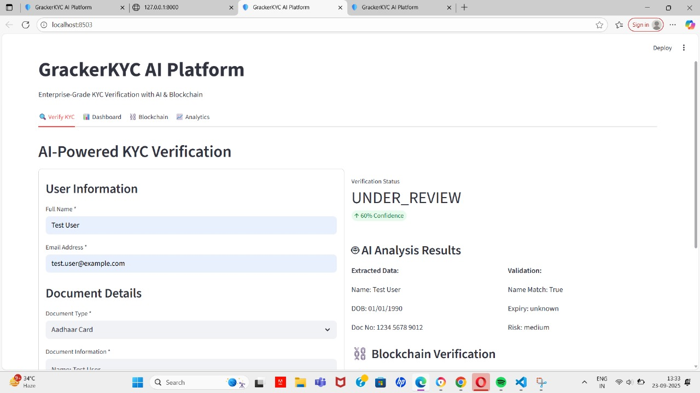
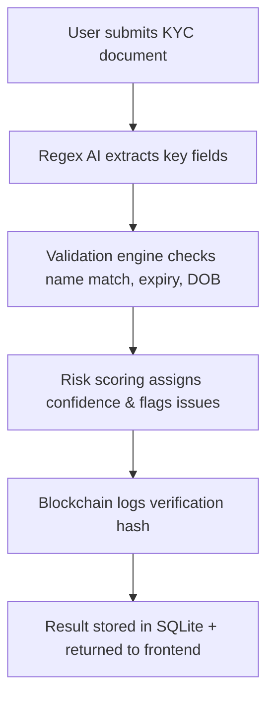

  

<h1 align="center">🔐 SMART KYC AI PLATFORM – Privacy-First Identity Verification 🔐</h1>

  <b>AI-Powered KYC with Blockchain Audit Trails & Ethical Risk Scoring</b> 
  <i>"सत्य वही है जो सुरक्षित हो, और सुरक्षा वही जो सत्य से निकले!"</i> 
  — Sakshi Tiwari

---

## 🌟 What is SMART KYC?

**SMART KYC AI** is a next-gen identity verification platform built with FastAPI, SQLite, and blockchain simulation.  
It uses regex-based AI analysis to extract and validate document data, assign risk scores, and store tamper-proof logs via blockchain.  
Designed for financial institutions, fintech startups, and compliance teams seeking ethical, privacy-safe KYC automation.

---

## 🌐 Live Demo Preview

  

---

## 🚀 Features

| AI-Powered Verification       | Blockchain & Privacy Design         |
|:-----------------------------:|:-----------------------------------:|
| Regex-based Document Parsing  | Tamper-proof Blockchain Hashes      |
| Confidence & Risk Scoring     | No Ollama Required (Lightweight AI) |
| Name/DOB/ID Extraction        | Local SQLite Storage                |
| Fraud Detection & Suggestions | CORS-enabled FastAPI Backend        |
| Dashboard-ready APIs          | Privacy-First Architecture          |

---

## 📈 How SMART KYC Works

