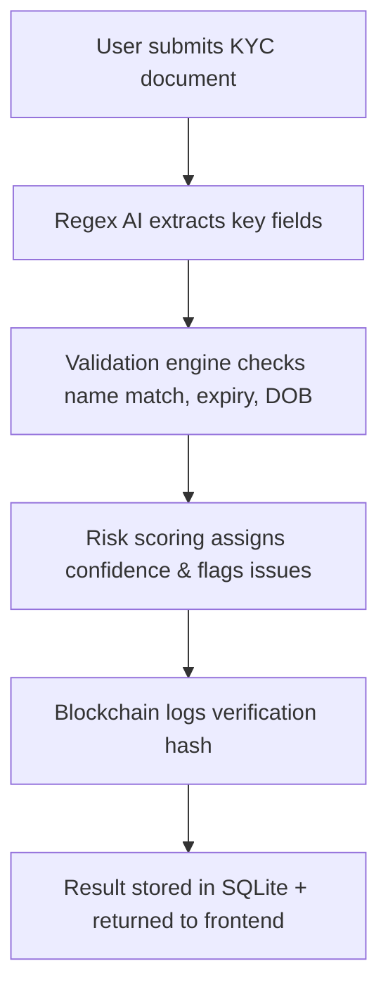

<p align="center">
  
</p>

<h1 align="center">🔐 SMART KYC AI PLATFORM – Privacy-First Identity Verification 🔐</h1>

<p align="center">
  <b>AI-Powered KYC with Blockchain Audit Trails & Ethical Risk Scoring</b><br>
  <i>"सत्य वही है जो सुरक्षित हो, और सुरक्षा वही जो सत्य से निकले!"</i><br>
  <sub>— Sakshi Tiwari</sub>
</p>

---

## 🌟 What is SMART KYC?

**SMART KYC AI** is a next-gen identity verification platform built with FastAPI, SQLite, and blockchain simulation.  
It uses regex-based AI analysis to extract and validate document data, assign risk scores, and store tamper-proof logs via blockchain.  
Designed for financial institutions, fintech startups, and compliance teams seeking ethical, privacy-safe KYC automation.

🌐 **Live Demo Preview:**  
<div align="center">
  
</div>

---

## 🚀 Features

| AI-Powered Verification       | Blockchain & Privacy Design         |
|:-----------------------------:|:-----------------------------------:|
| Regex-based Document Parsing  | Tamper-proof Blockchain Hashes      |
| Confidence & Risk Scoring     | No Ollama Required (Lightweight AI) |
| Name/DOB/ID Extraction        | Local SQLite Storage                |
| Fraud Detection & Suggestions | CORS-enabled FastAPI Backend        |
| Dashboard-ready APIs          | Privacy-First Architecture          |

---

## 📈 How SMART KYC Works



---

## 🧪 Sample API Request

```json
POST /api/v1/verify
{
  "name": "Test User",
  "email": "test.user@example.com",
  "document_text": "Name: Test User\nDOB: 01/01/1990\nNumber: 123456789012",
  "document_type": "Aadhaar Card"
}
```

---

## 📂 Project Structure

```bash
├── backend.py          # FastAPI server with AI + Blockchain logic
├── frontend.py         # Optional UI integration (React/Streamlit)
├── gracker_kyc.db      # SQLite database for KYC records
├── requirements.txt    # Python dependencies
├── assets/             # Logo, screenshots, and demo images
└── README.md           # You're reading it!
```

---

## 🔧 Installation

```bash
# Clone the repo
git clone https://github.com/Sakshi983-cmd/SMART-KYC-AI.git
cd SMART-KYC-AI

# Install dependencies
pip install -r requirements.txt

# Run the backend
uvicorn backend:app --reload
```

---

## 📬 Contact

**Built by:** Sakshi Tiwari  
**Email:** tiwarishakshi318@gmail.com  
**GitHub:** [Sakshi983-cmd](https://github.com/Sakshi983-cmd)

---

## 🧘 Vision

SMART KYC is more than a tech tool—it’s a statement.  
A commitment to ethical AI, privacy-first design, and karmic accountability in financial systems.  
Crafted by a developer who believes that **truth, transparency, and technology** must walk together.


